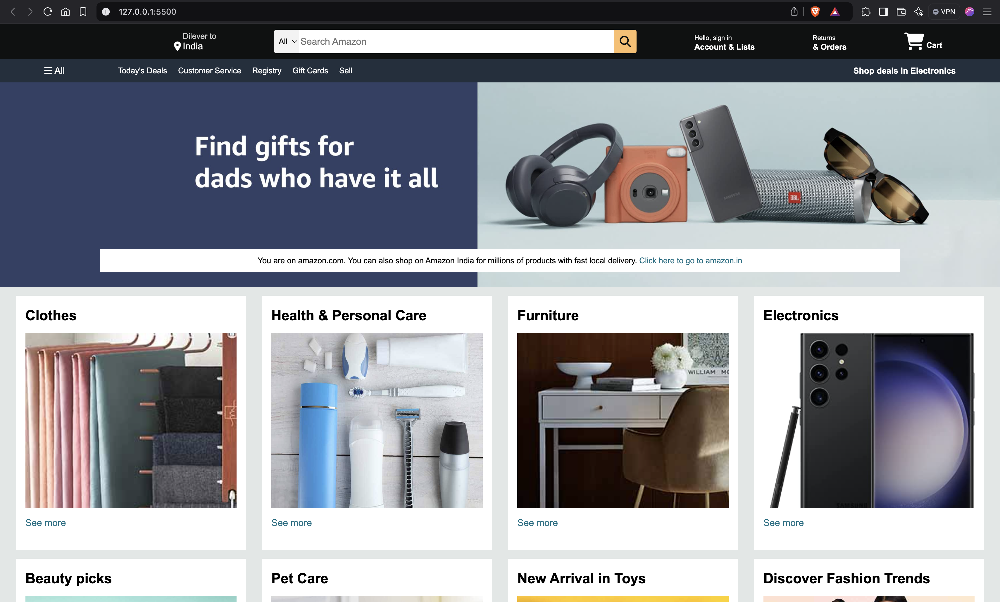

# Amazon Clone - Front-End Project

This is my **first front-end project**, where I replicated the Amazon homepage using **HTML** and **CSS**. The purpose of this project was to get hands-on experience with the basics of web development, focusing on layout, styling, and responsiveness.

---

## 🚀 Project Overview

The Amazon Clone mimics the homepage of Amazon, featuring a clean layout with a search bar, product listings, and navigation menu. It's fully responsive, making it suitable for both desktop and mobile devices.

---

## 🛠️ Technologies Used

- **HTML**: For structuring the content and elements.
- **CSS**: For styling the page and making it visually appealing.
- **Responsive Design**: Using media queries to ensure the page adapts to different screen sizes.

---

## 📸 Screenshots

### Desktop View


---

## 💻 Installation & Setup

To view this project on your local machine, follow these simple steps:

1. **Clone the repository**:
   ```bash
   git clone https://github.com/AryanP107/Amazon-Clone.git

